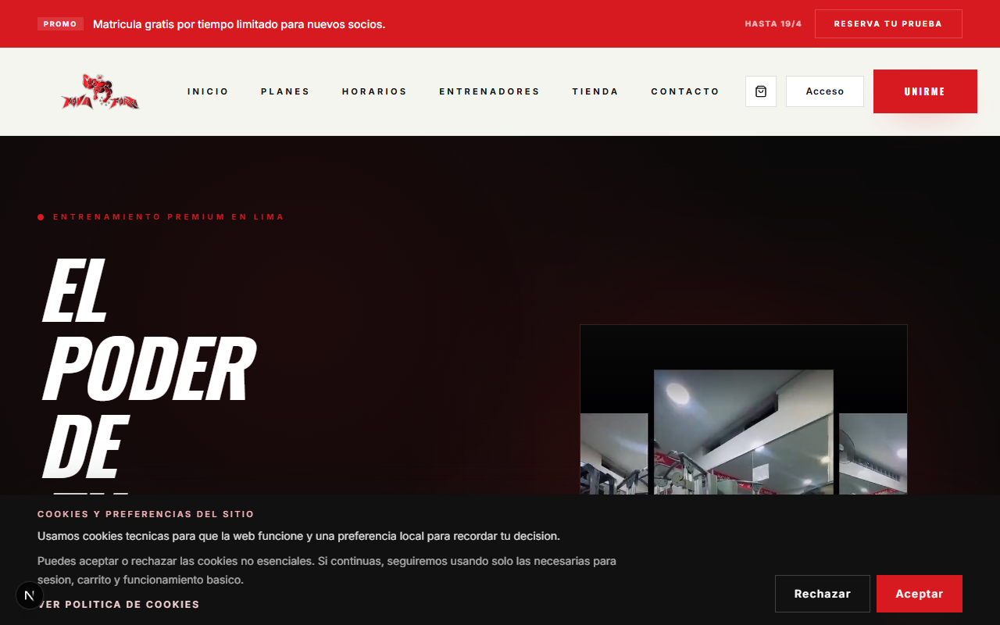
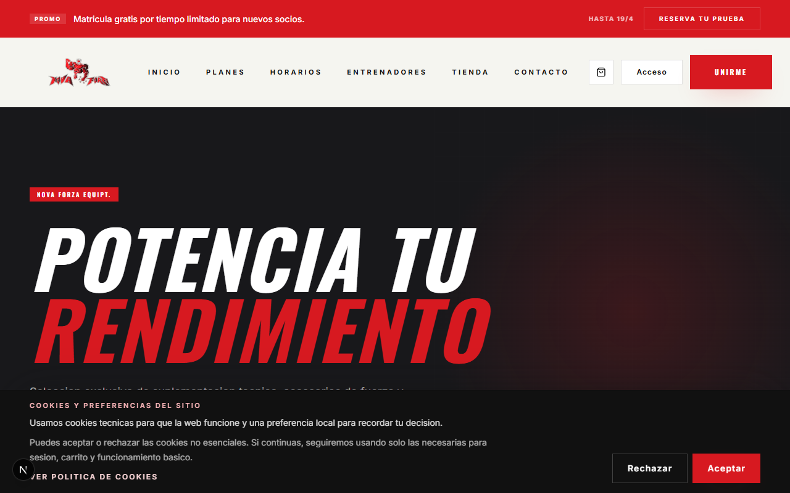
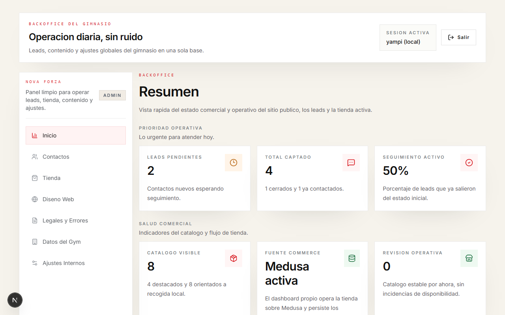
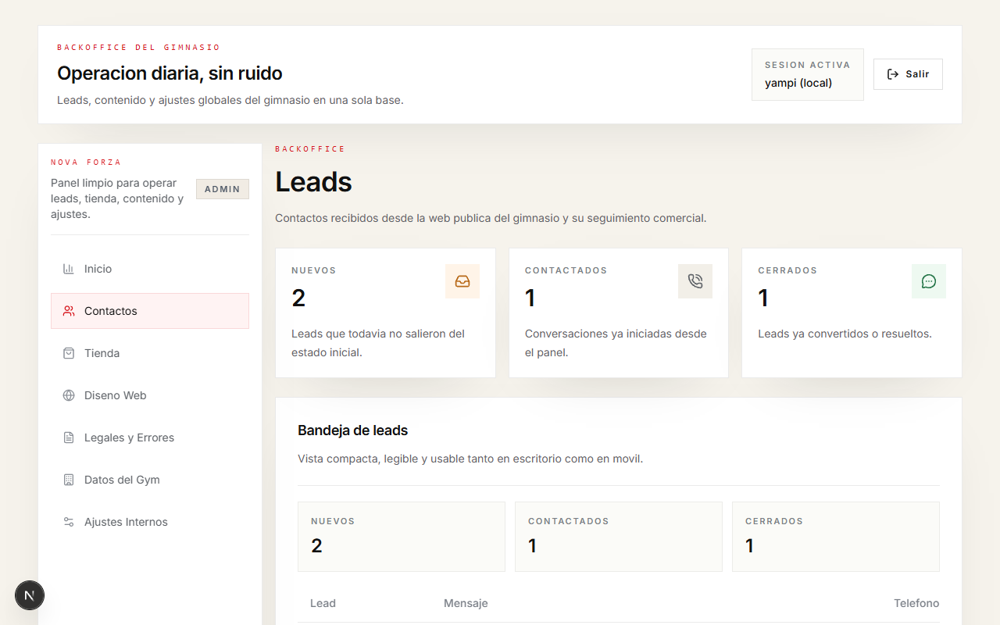
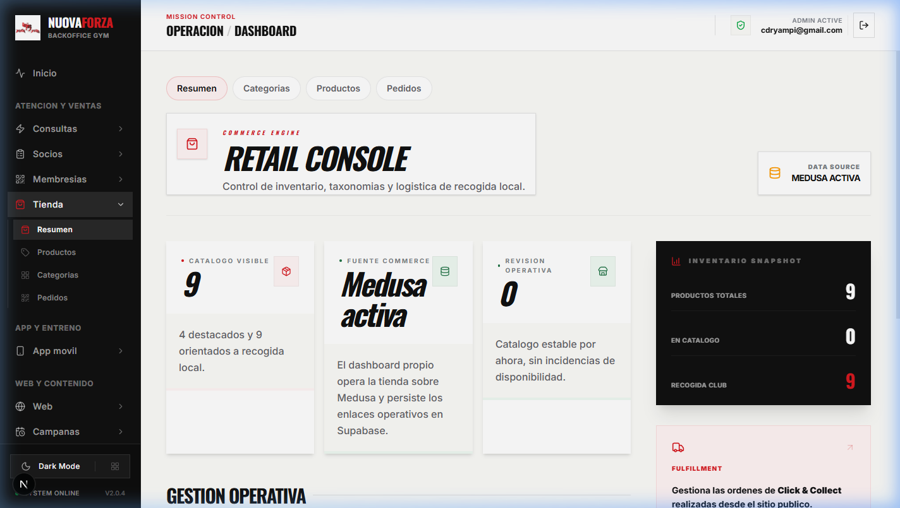
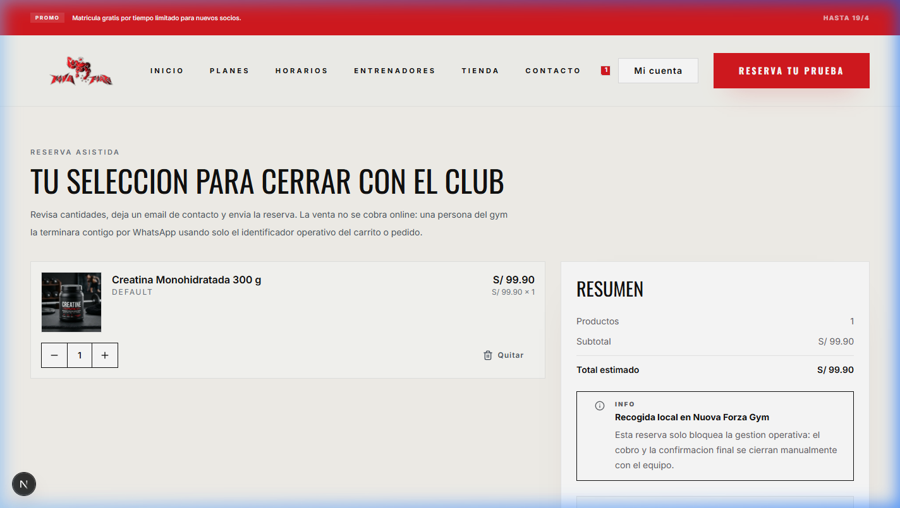
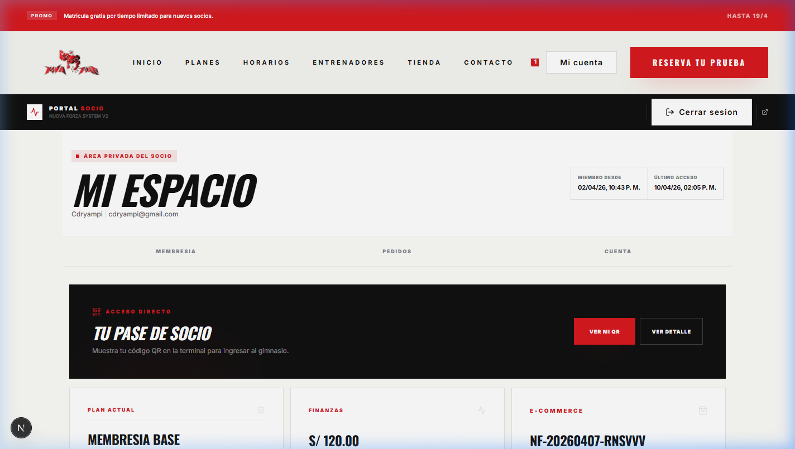
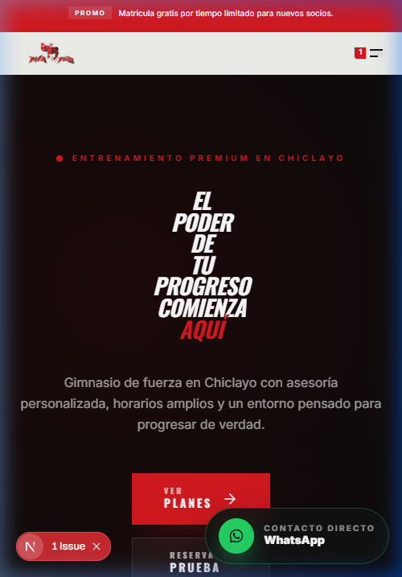

# Nova Forza


Base de producto para un gimnasio local con web publica, backoffice propio y capa commerce desacoplada. Hoy esta orientado a **Nova Forza**, pero la estructura se esta manteniendo lo bastante limpia como para servir de base a futuros forks del vertical fitness o negocios locales similares.

## Que incluye hoy

- web publica comercial en `src/app/(public)`
- login y dashboard propio en `src/app/(admin)/dashboard`
- leads y ajustes globales en Supabase
- planes y horarios editables desde dashboard/Supabase
- tienda, carrito y checkout pickup
- mi-cuenta y seguimiento de pedidos pickup

## Vistas del producto

### Web publica y tienda



### Dashboard propio




### Checkout y cuenta




## Arquitectura

- `Next.js 16` y `React 19` para la experiencia publica y el backoffice
- `Supabase` para auth, leads, settings y dominio no-commerce
- `apps/medusa` como backend de catalogo y operaciones commerce
- `Tailwind CSS v4`, `TypeScript`, `react-hook-form`, `zod` y `Vitest`

Mas contexto en [docs/commerce-medusa-migration.md](docs/commerce-medusa-migration.md).

## Frontera operativa

La regla del proyecto es simple:

- la UI operativa del negocio vive en `src/app/(admin)/dashboard`
- Medusa se usa como motor de catalogo y APIs, no como panel del negocio
- Supabase sigue siendo el backend principal del gym y la capa de soporte para IDs puente y dominio propio
- el storefront no cae a datos locales ni a tablas legacy cuando Medusa falla
- testimonios, zonas y equipo siguen estaticos de forma consciente hasta la siguiente fase de marketing

## Desarrollo local

### Frontend y dashboard

```bash
npm install
npm run dev
```

### Medusa en modo desarrollo

```bash
npm --prefix apps/medusa install
npm run dev:medusa
```

### Medusa + Redis con Docker

```bash
npm run dev:backend
```

Si trabajas en Windows con Docker Desktop, revisa [docs/local-redis-windows.md](docs/local-redis-windows.md).

## Variables de entorno

Completa `.env.local` a partir de `.env.example`.

### Core del proyecto

- `NEXT_PUBLIC_SUPABASE_URL`
- `NEXT_PUBLIC_SUPABASE_ANON_KEY`
- `SUPABASE_SERVICE_ROLE_KEY`
- `ADMIN_USER`
- `ADMIN_PASSWORD`

### Storefront y dashboard de tienda

- `COMMERCE_PROVIDER=medusa`
- `STORE_ADMIN_PROVIDER=medusa`
- `COMMERCE_CURRENCY_CODE=PEN`
- `COMMERCE_LOCALE=es-PE`
- `NEXT_PUBLIC_COMMERCE_CURRENCY_CODE=PEN`
- `NEXT_PUBLIC_COMMERCE_LOCALE=es-PE`
- `MEDUSA_BACKEND_URL`
- `MEDUSA_ADMIN_API_KEY`
- `MEDUSA_PUBLISHABLE_KEY`
- `MEDUSA_REGION_ID`
- `MEDUSA_REGION_NAME=Peru`
- `MEDUSA_COUNTRY_CODE=PE`

### Correo transaccional pickup

- `SMTP_HOST`
- `SMTP_PORT`
- `SMTP_SECURE`
- `SMTP_USER`
- `SMTP_PASSWORD`
- `SMTP_FROM_EMAIL` opcional

## Notas para forks

Si mas adelante reutilizas esta base para otro negocio:

- manten branding y contenido editable fuera del codigo duro siempre que sea posible
- conserva la frontera `Next.js UI -> Medusa catalogo -> Supabase soporte`
- cambia moneda, region y proveedor por entorno, no por hardcode
- reemplaza las capturas de `.github/assets/readme/` por assets del nuevo proyecto

## Documentacion relacionada

- [Migracion commerce a Medusa](docs/commerce-medusa-migration.md)
- [Deploy full stack con Dokploy](docs/dokploy-full-stack.md)
- [Snapshot visual del producto](docs/product-snapshot.md)
- [Auditoria legacy de fase 0](docs/legacy-audit-phase-0.md)
- [Matriz de cierre del core 12-16](docs/core-closure-matrix.md)
- [Smoke checklist del core](docs/core-smoke-checklist.md)
- [Smoke de PayPal sandbox](docs/paypal-sandbox-smoke.md)
- [SMTP con Gmail para pickup](docs/smtp-gmail-setup.md)
- [Redis local en Windows](docs/local-redis-windows.md)

## Calidad

Antes de cerrar cambios relevantes:

```bash
npm run lint
npm run typecheck
npm run test
npm run build
```
