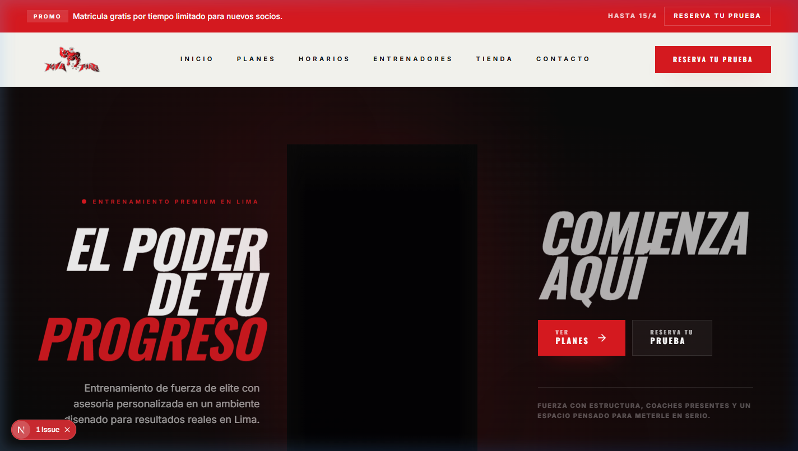
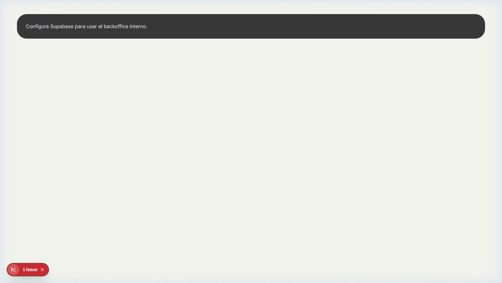

# Nova Forza - Gym & Backoffice

[](https://github.com/google-deepmind/antigravity)

Plataforma integral para el gimnasio **Nova Forza**, que combina un sitio web público de alto impacto comercial con un backoffice operativo para la gestión diaria.



## 🎯 Propósito

Este proyecto centraliza la presencia digital del gimnasio en una única base de código, permitiendo una evolución coherente de:
- **Web Pública:** Captación de leads y exhibición de marca.
- **Backoffice:** Gestión de leads, ajustes globales y futura operativa (CMS).
- **Backend Unificado:** Infraestructura preparada para alimentar una futura App Móvil.

---

## 🚀 Tecnologías Principales

- **Framework:** [Next.js 16](https://nextjs.org/) (App Router)
- **UI:** [React 19](https://react.dev/), [Tailwind CSS v4](https://tailwindcss.com/)
- **Lenguaje:** [TypeScript](https://www.typescriptlang.org/)
- **Backend & Auth:** [Supabase](https://supabase.com/)
- **Formularios:** React Hook Form + Zod
- **Testing:** Vitest

---

## 🛠️ Configuración Local

### 1. Clonar e Instalar
```bash
npm install
```

### 2. Variables de Entorno
Crea un archivo `.env.local` con las siguientes claves:
```env
NEXT_PUBLIC_SUPABASE_URL=tu_url_supabase
NEXT_PUBLIC_SUPABASE_ANON_KEY=tu_anon_key
SUPABASE_SERVICE_ROLE_KEY=tu_service_role_key

# Opcionales para acceso local (fallback)
ADMIN_USER=admin
ADMIN_PASSWORD=password
```
*Si no se configuran las variables de Supabase, el sistema utilizará datos de fallback (mock).*

### 3. Iniciar Servidor
```bash
npm run dev
```
- **Web:** [http://localhost:3001](http://localhost:3001)
- **Login:** [http://localhost:3001/login](http://localhost:3001/login)

---

## 📂 Estructura del Proyecto

```txt
src/
  app/
    (public)/          # Home comercial
    (auth)/login       # Acceso al panel
    (admin)/dashboard  # Backoffice (Leads, Ajustes, Contenido)
  components/
    marketing/         # Bloques de la web pública
    admin/             # Componentes del dashboard
    ui/                # Primitivos de interfaz (shadcn-like)
  lib/
    data/              # Mock data y constantes
    supabase/          # Cliente y consultas
    validators/        # Esquemas de validación (Zod)
supabase/              # Migraciones y Seed SQL
docs/                  # Documentación y assets
```

---

## 🖼️ Vistas Actuales

### Dashboard Operativo
Gestión centralizada de leads y configuración del sitio.

| Resumen General | Leads |
| :--- | :--- |
|  |  |

### Gestión de Contenidos
Ajustes globales del sitio desde el panel administrativo.


---

## 📋 Módulos y Estado

- [x] **Home Pública:** Diseño atlético y premium con video hero.
- [x] **Training Zones:** Carrusel dinámico de disciplinas.
- [x] **Lead Management:** Captura y visualización de prospectos en backoffice.
- [x] **Mock System:** Sistema de fallback robusto para desarrollo sin backend.
- [ ] **Módulos Futuros:** Planes, Horarios, Reservas, Tienda Pickup (en roadmap).

---

## ⚙️ Scripts Disponibles

- `npm run dev`: Arranca el entorno de desarrollo.
- `npm run build`: Genera el bundle de producción.
- `npm run lint`: Ejecuta el análisis estático de código.
- `npm run typecheck`: Valida la integridad de tipos TS.
- `npm run test`: Ejecuta la suite de pruebas con Vitest.

---

## 📽️ Assets y Media

Para cambiar el video principal del Hero, sustituya el archivo en:
- `public/videos/video.mp4`

Las imágenes de las zonas de entrenamiento se gestionan en:
- `src/data/training-zones.ts`

---

> [!IMPORTANT]
> Este proyecto utiliza **Antigravity** como herramienta de QA y validación visual. Cada cambio importante es revisado para asegurar coherencia técnica y visual.
