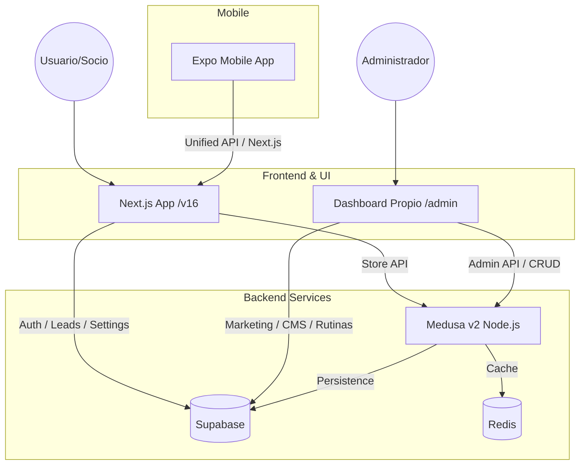

# Arquitectura del Sistema - Nova Forza

Este documento describe la arquitectura técnica y la integración de servicios del ecosistema **Nova Forza**.

## Visión General

El proyecto está diseñado como un sistema desacoplado donde la interfaz de usuario reside en **Next.js**, la lógica transaccional de comercio en **Medusa v2**, y la infraestructura de soporte, autenticación y datos no transaccionales en **Supabase**.

## Componentes Core

### 1. Frontend (Next.js 16 + React 19)
- **RSC (Server Components)**: Utilizados por defecto para fetching de datos y SEO optimizado.
- **Tailwind CSS v4**: Motor de estilos para una interfaz premium y oscura.
- **TanStack Query / Actions**: Manejo de estado y mutaciones en el dashboard.

### 2. Backend de Soporte (Supabase)
Supabase actúa como la base de datos de infraestructura y el sistema de identidad principal.
- **Auth**: Gestión de usuarios, roles y sesiones.
- **PostgreSQL**: Almacena leads, planes, horarios, rutinas, miembros y configuraciones del sitio.
- **Bridge Data**: Para evitar desincronización con Medusa, Supabase almacena IDs de referencia (`medusa_product_id`, `medusa_category_id`).

### 3. Backend de Comercio (Medusa v2)
Medusa es la **fuente operativa de verdad** para todo lo relacionado con el eCommerce.
- **Catálogo**: Productos, variantes, categorías y stock.
- **Pedidos**: Gestión de pedidos pickup, estados de cumplimiento y pagos (PayPal).
- **Integración**: Comparte la misma instancia de PostgreSQL de Supabase pero en un esquema/servicio separado.

### 4. App Móvil (Expo)
Ubicada en `apps/mobile`, consume la misma lógica de negocio y backend a través de endpoints unificados en Next.js o comunicación directa con Supabase/Medusa.

## La "Frontera" de Datos

Para mantener el sistema mantenible, se sigue una regla estricta de fronteras:

| Dominio | Servicio Primario | Notas |
| --- | --- | --- |
| Autenticación | Supabase Auth | Sistema único de Login. |
| Leads / Contacto | Supabase DB | Mensajes de la web pública. |
| Catálogo (Tienda) | Medusa v2 | CRUD vía Dashboard propio -> Medusa Admin API. |
| Rutinas / Ejercicios | Supabase DB | Dominio específico del gimnasio. |
| Marketing CMS | Supabase DB | Reseñas, planes y horarios. |
| Pagos | Medusa + PayPal | Flujo de checkout transaccional. |

## Desarrollo e Integración

- **Sync Script**: Existe un script `npm run sync:store:medusa` que permite migrar datos legacy desde Supabase hacia Medusa asegurando que los IDs puente se persistan correctamente.
- **Operational Dashboard**: El equipo **no utiliza el admin nativo de Medusa**. Toda la gestión se hace desde el dashboard personalizado en `/dashboard`, el cual actúa como orquestador entre Supabase y Medusa.

---
*Última actualización: Abril 2026*
