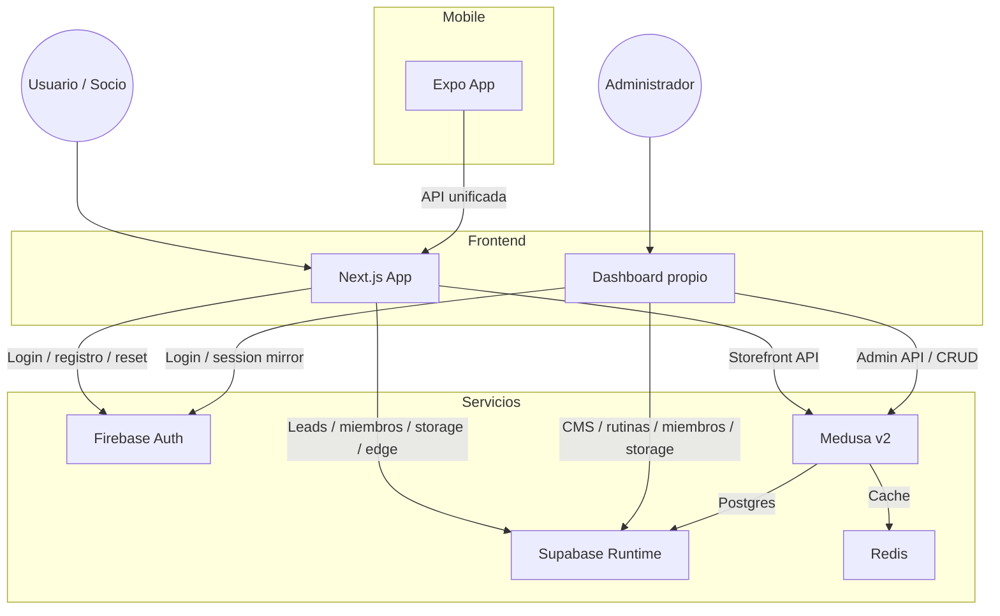

# Arquitectura del Sistema - Nova Forza

Este documento describe la arquitectura tecnica y la integracion de servicios del ecosistema **Nova Forza**.

## Vision general

El proyecto esta disenado como un sistema desacoplado donde:

- **Next.js** sirve la web publica, el panel y las rutas de servidor
- **Firebase Auth** resuelve la identidad de socios y backoffice
- **Supabase** aloja PostgreSQL, Storage, Edge Functions y datos de dominio
- **Medusa v2** opera la capa commerce sobre PostgreSQL en Supabase



## Componentes core

### 1. Frontend
- **Next.js 16 + React 19** para web publica, panel y rutas del servidor.
- **Tailwind CSS v4** para la capa visual.
- **Server Components** por defecto; cliente solo cuando el flujo lo exige.

### 2. Identidad
- **Firebase Auth** es la fuente unica de identidad.
- El cliente replica el Firebase ID token en una cookie HTTP-only (`gym_firebase_session`).
- `proxy.ts`, rutas y server components verifican esa cookie con Firebase Admin.
- Los correos de auth salen por **SMTP propio** usando action links generados por Firebase Admin SDK.

### 3. Runtime de datos
- **Supabase Postgres** guarda leads, miembros, rutinas, settings y puentes con Medusa.
- **Supabase Storage** guarda imagenes y assets internos.
- **Supabase Edge Functions** sigue disponible para tareas puntuales.
- `public.user_roles` sigue siendo la fuente de verdad para roles `admin` y `trainer`.

### 4. Commerce
- **Medusa v2** es la fuente operativa de verdad para catalogo y pedidos.
- El dashboard propio escribe en Medusa Admin API.
- Supabase persiste IDs puente como `products.medusa_product_id` y `store_categories.medusa_category_id`.
- No se usa el admin nativo de Medusa como panel del negocio.

### 5. App movil
- `apps/mobile` consume la misma logica de negocio desde Next.js y Supabase.

## Frontera de datos

| Dominio | Servicio primario | Notas |
| --- | --- | --- |
| Autenticacion | Firebase Auth | Login, registro, reset y verify email |
| Roles backoffice | Supabase DB | `public.user_roles` |
| Leads / contacto | Supabase DB | Dominio publico |
| Miembros / rutinas | Supabase DB | Dominio propio del gym |
| Storage CRM | Supabase Storage | Imagenes y assets internos |
| Catalogo tienda | Medusa v2 | CRUD via dashboard propio |
| Pedidos / checkout | Medusa + PayPal | Flujo pickup |
| Emails auth | SMTP propio + Firebase Admin | Verify, reset y email change |

## Session model

1. El usuario inicia sesion en Firebase Auth.
2. El cliente llama a `/api/auth/session` con el ID token.
3. Next.js guarda `gym_firebase_session` como cookie HTTP-only.
4. El servidor verifica el token con Firebase Admin.
5. Supabase recibe el JWT de Firebase para acceso user-scoped.

## Migracion de usuarios

El release incluye un script one-off:

```bash
npm run auth:migrate:firebase
```

Ese flujo:

1. busca o crea usuarios en Firebase por email
2. mantiene `emailVerified` cuando es posible
3. reescribe referencias enlazadas en Supabase hacia el nuevo `uid`
4. deja el onboarding final por reset/set-password asistido

No se migran hashes de contrasena.

## Reglas operativas

- Firebase se usa solo para Auth en esta fase.
- Supabase no vuelve a ser el proveedor de sesion principal.
- Storage del CRM vive en Supabase, no en Firebase Storage.
- Medusa sigue igual sobre Postgres en Supabase.
- Si un cambio toca auth, revisar tambien SMTP y el mirror de sesion.

---
Ultima actualizacion: Abril 2026
