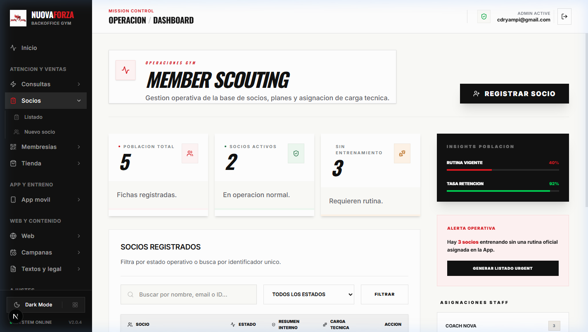
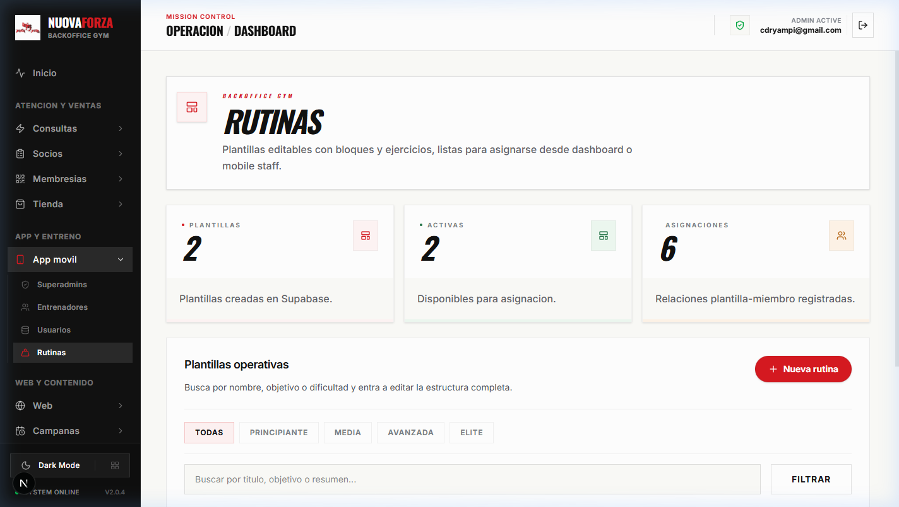
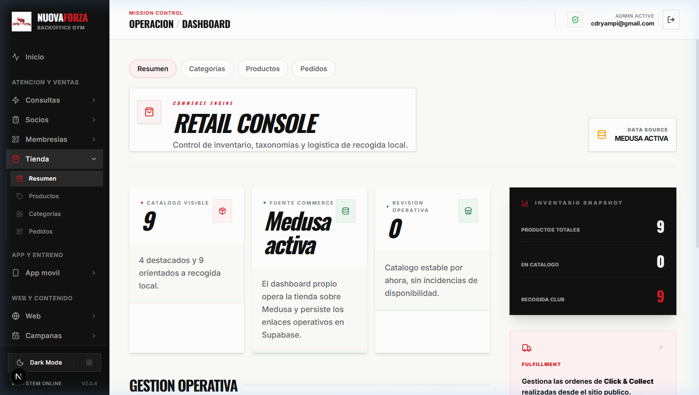

# Manual de Usuario - Nova Forza Gym

Este documento es la guía oficial para gestionar el ecosistema digital de **Nova Forza Gym**.

## 1. Acceso al Panel (Backoffice)

El dashboard es el centro de mando del gimnasio.

- **URL:** `https://nuovaforzagym.com/login` (o dominio local `/login`).
- **Credenciales:** Usa tu cuenta de Supabase autorizada.
- **Roles:** Solo los usuarios en `ADMIN_ALLOWED_EMAILS` pueden realizar cambios críticos.

---

## 2. Gestión de Marketing y CMS

Desde la sección **Marketing**, puedes controlar qué ven los usuarios en la web pública.

### Moderación de Reseñas (Testimonios)
1. Ve a **Marketing** -> **Moderación de Reseñas**.

2. Los socios pueden enviar reseñas desde su área privada ("Mi Cuenta").
3. Revisa las reseñas pendientes:
   - **Aprobar**: La reseña aparecerá en el carrusel de la página de inicio.
   - **Rechazar**: La reseña se guardará pero no será visible públicamente.

### Planes y Horarios
- Los planes de precios y los horarios de las clases se editan directamente desde los subapartados de Marketing.
- Los cambios son instantáneos en las rutas `/planes` y `/horarios`.

---

## 3. Módulo de Miembros

En la sección **Miembros**, gestionas la base de datos de socios del gimnasio.

- **Registro de nuevo socio**: Crea el perfil básico, vincula un correo electrónico (para su acceso privado) y define su estado de membresía.
- **Búsqueda**: Filtra por nombre, email o estado para encontrar rápidamente a un socio.
- **Detalle de socio**: Desde aquí puedes ver sus datos de contacto, historial de pagos y rutinas asignadas.

---

## 4. Gestión de Rutinas

El gimnasio permite ofrecer rutinas personalizadas a los socios.

1. Ve a **Rutinas**.
2. **Crear nueva rutina**: Define el nombre, nivel de dificultad y añade los ejercicios con sus series y repeticiones.
3. **Asignación**: Desde el detalle de un miembro, puedes asignarle una de las rutinas creadas.
4. El socio podrá ver su rutina desde su App móvil o desde su cuenta web.

---

## 5. Tienda y Pedidos (Pickup)

Operamos con un modelo de **Recogida en tienda**.

### Gestión de Pedidos
1. Cuando un cliente realiza una compra, el pedido aparece en **Tienda** -> **Pedidos**.
2. **Estados del pedido**:
   - `Pendiente`: El pago se ha realizado, el personal debe preparar el producto.
   - `Listo para recogida`: Cambia a este estado para notificar al cliente que puede pasar por el gimnasio.
   - `Entregado`: Marca el pedido como completado cuando el socio recoja su compra.

### Catálogo
- Los productos se gestionan en la sección **Catálogo**.
- Puedes editar descripciones, precios y stock. Los datos se sincronizan automáticamente con el motor de Medusa.

---

## 6. Soporte Técnico

Si encuentras fallos o necesitas ayuda con el panel:
- **Email:** soporte@nuovaforzagym.com
- **Runbook Técnico:** Para problemas de sincronización, consulta `docs/architecture.md`.

---
*Última actualización: Abril 2026*
