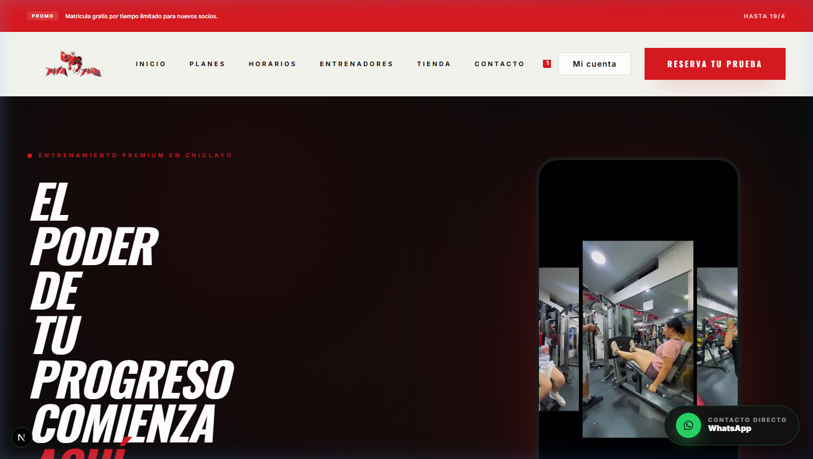
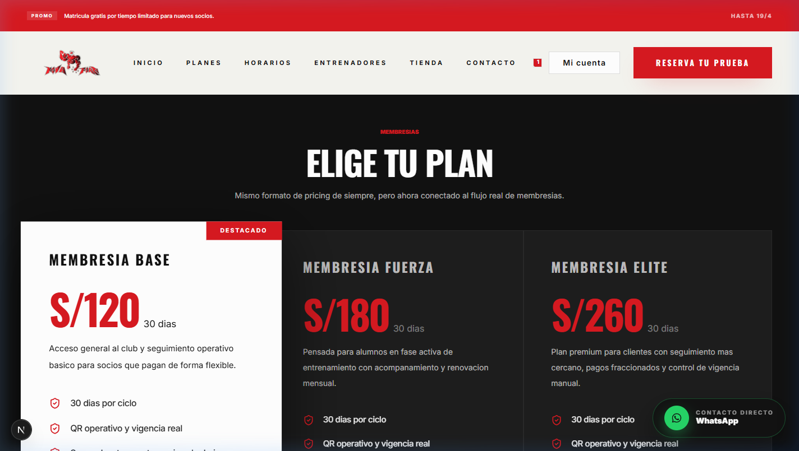
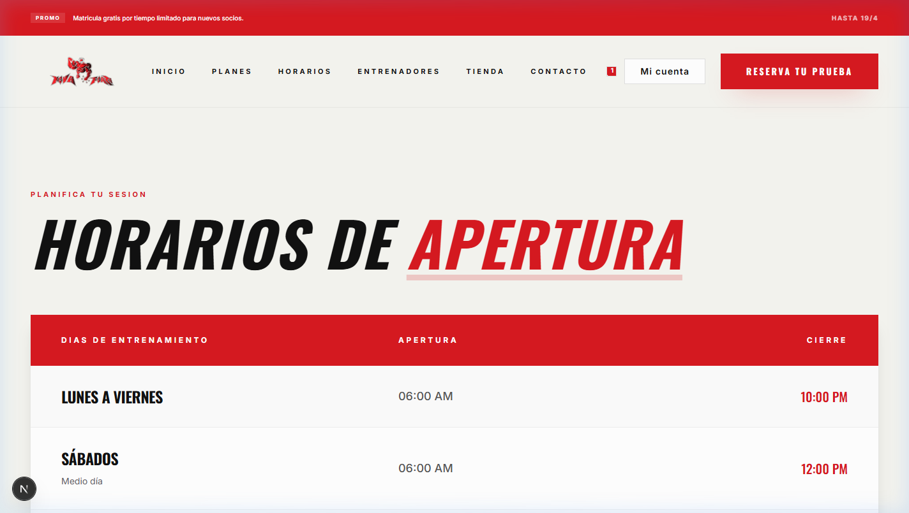
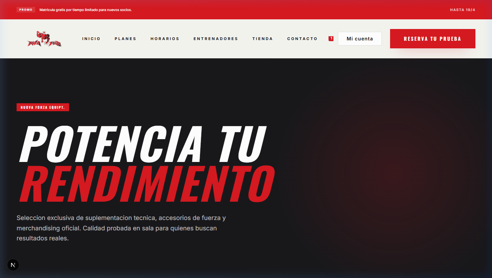
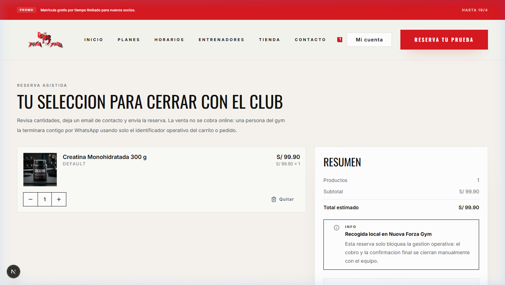
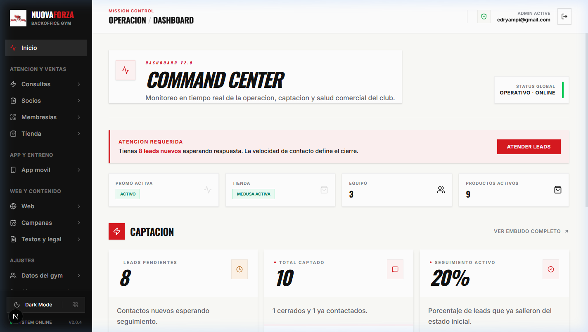
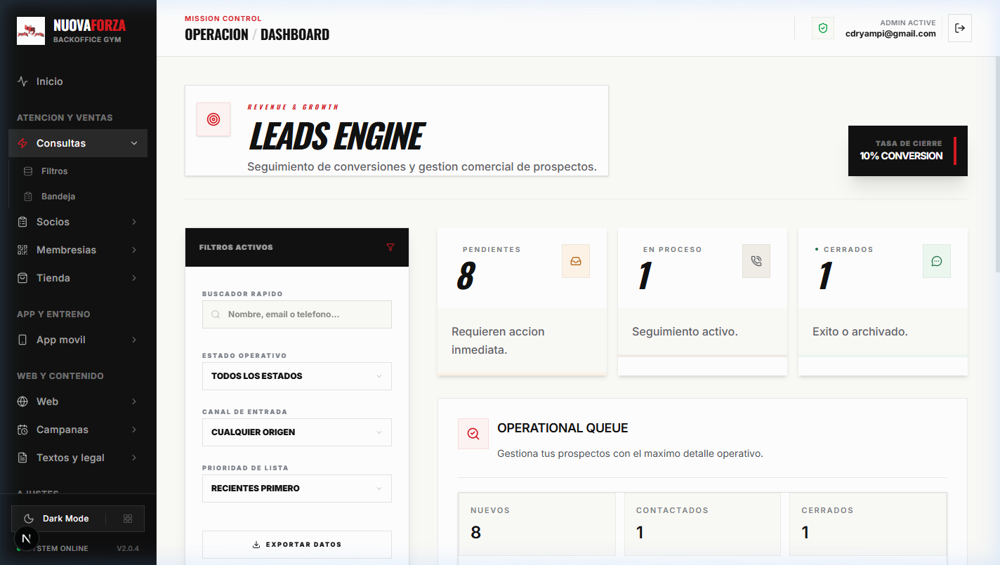
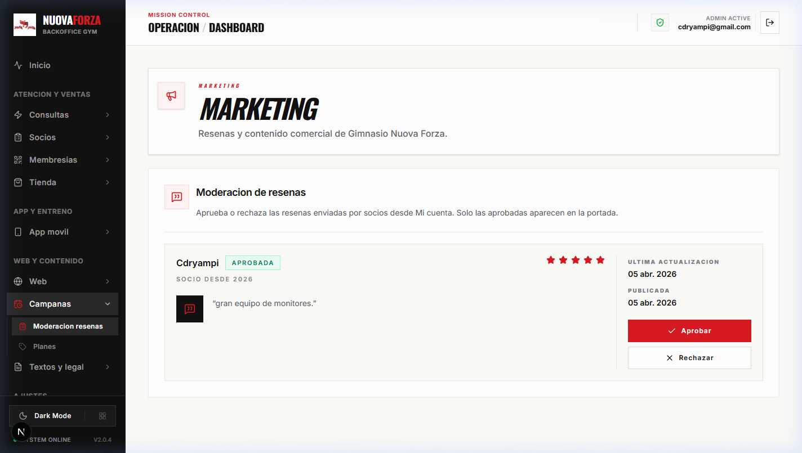
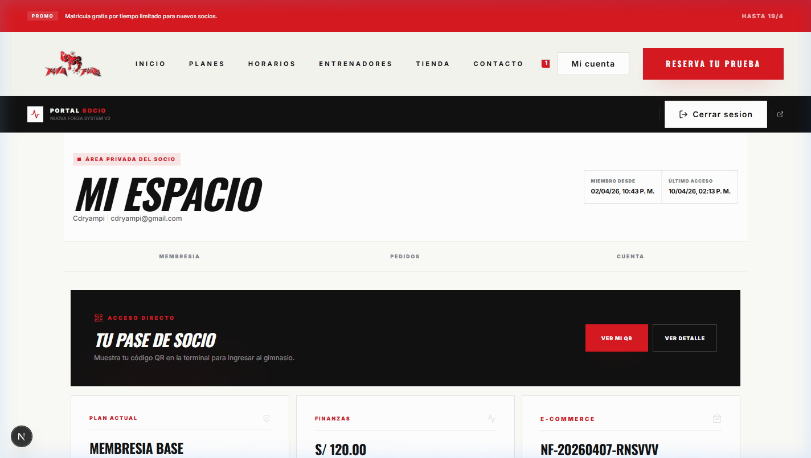

# 🖼️ Galería Visual del Producto

Este documento proporciona una vista rápida y actualizada de las interfaces de Nova Forza para propósitos de QA, diseño y contexto de desarrollo.

---

## 🌐 Web Pública (Comercial)

### Portada Principal
La identidad visual de Nuova Forza en Chiclayo. Incluye secciones dinámicas de Planes y Horarios.

### Planes y Membresías
Página dedicada a la venta de suscripciones, sincornizada con el CMS operativo.

### Horarios de Clases
Grilla interactiva de horarios gestionada desde el panel administrativo.

---

## 🛒 E-commerce (Tienda)

### Catálogo de Productos
Experiencia de compra fluida impulsada por Medusa v2.

### Flujo de Carrito y Checkout
Optimizado para pedidos tipo "Pickup" (Recojo en tienda).

---

## ⚙️ Panel Administrativo (Mission Control)

### Centro de Comando (Overview)
Monitoreo en tiempo real de la salud operativa, ventas y leads.

### Gestión de Prospectos (Leads)
Control total sobre los contactos comerciales y estado de conversión.

### Marketing y Contenido
Herramientas para moderar testimonios y actualizar la información de la web sin tocar código.

---

## 👤 Área del Socio

### Mi Cuenta
Espacio privado para socios donde consultan sus pedidos y gestionan su información.

---
*Última actualización: Abril 2026*
